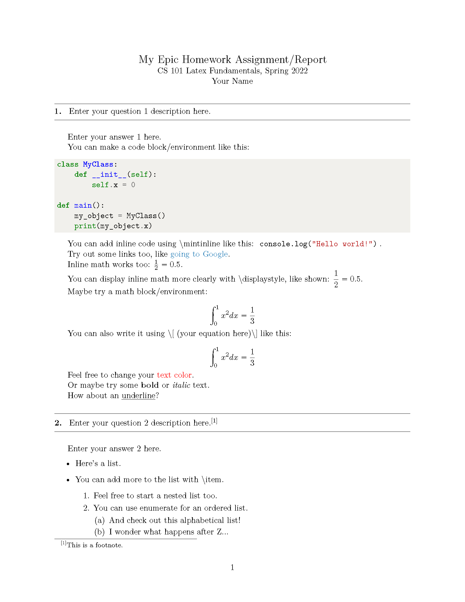

<!-- PROJECT LOGO -->
 

  

  <h3 align="center">report-template</h3>
  

    <a href="https://www.overleaf.com/read/nghcfhgrsztp"><strong>Build your report on Overleaf! »</strong></a>
     
  

# LaTeX Report Template

A homework/report template in LaTeX with multiple features (local environment files).

## Overleaf Template

[**Click here** to go to the Overleaf template](https://www.overleaf.com/read/nghcfhgrsztp) which you can make a copy of and work on it within your browser. Once registered or signed into Overleaf, you can follow the steps below to build your copy.

## Some Features

- Code blocks
- Inline code
- Hyperlinks

## Acknowledgements

- [Initial template from this GitHub repository](https://github.com/WorcesterSociety/HomeworkTemplate).
